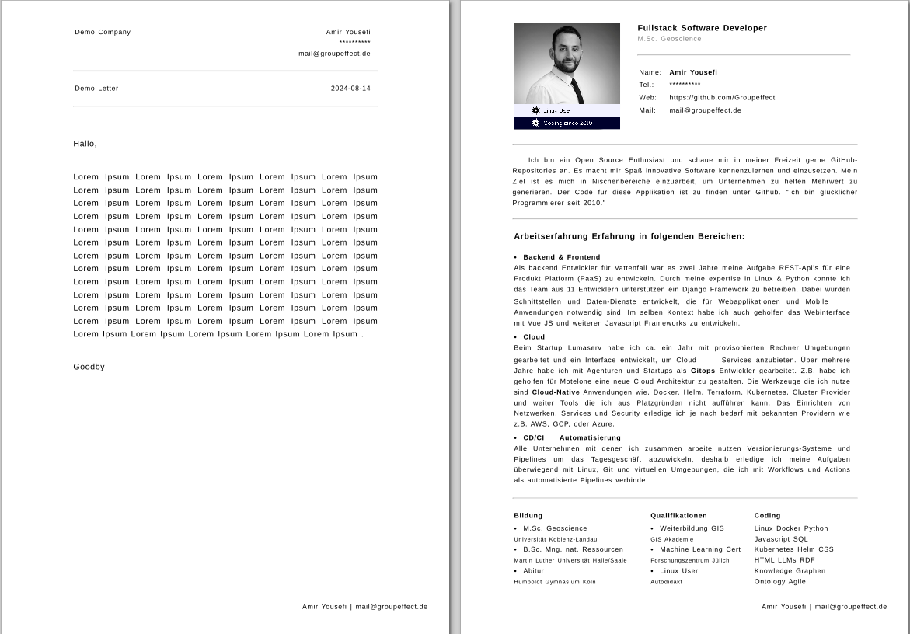

# Cvitae

An application to create portfolios with seperated data, structure and layout.
You can customize the templates and adjust "TemplateConfig" instances to serve
different version of the same appliction instance. Print the result in your Browser for PDF
application. Or create documents / websites and reuse database and templates.
Create Browsable REST-Api's  with django rest framework.

[Demo PDF Document](DemoDocument.pdf)



[Setup with CLI](app/cli.sh)
```
# Demo usage in shell

# go to the app path
cd ./app

# install demo setup
source cli.sh && cmd_simple_install

# follow cli instructions
# then open in your browser
# api -> http://localhost:8000/api
# admin -> http://localhost:8000/admin

# run server
source cli.sh && run
```
[Setup with docker-compose](docker-compose.yaml)

```
# Requirements: Docker or Podman 
# or something else that can run docker-compose or Docker files.
# Start with docker-compose

docker-compose up

# Stop

docker-compose down
```

[Setup with Makefile](Makefile)

***Keywords***

- Python
- Javascript
- Django
- django rest framework
- Docker
- Bash
- Makefile
- Backend
- Frontend
- Portfolio
- CV


